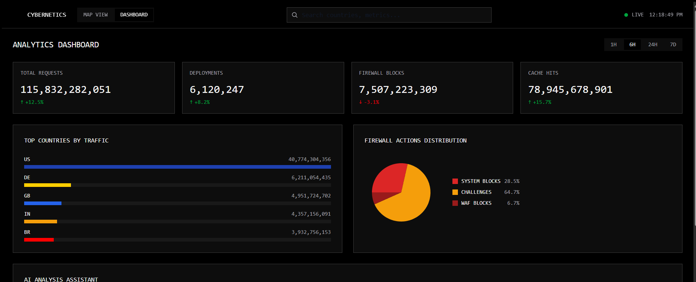
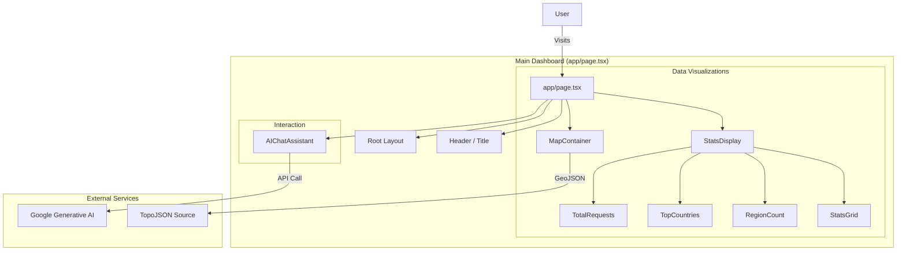
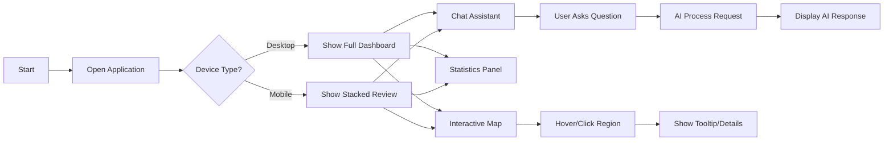

# 🌐 Cybernetics AI Black Friday Analysis


> A futuristic dashboard for visualizing global AI analysis requests, featuring interactive maps, real-time statistics, and an AI-powered chat assistant.

---

## 🖼️ Preview

<div align="center">
  
</div>

<br/>

<div align="center">
  
  
</div>

---

## 🚀 Features

- **Interactive Global Map**: Visualizes data points across different countries using `react-simple-maps` and `d3-geo`.
- **Real-time Statistics**: Displays total requests, top countries, and region counts dynamically.
- **AI Chat Assistant**: Integrated `AIChatAssistant` for user querying and interaction (powered by Google Generative AI).
- **Responsive Design**: Fully optimized for mobile, tablet, and desktop views with a cyber-aesthetic.
- **Modern Tech Stack**: Built with the latest Next.js 15, React 19, and Tailwind CSS v4.

---

## 🛠️ Technology Stack

| Category | Technologies |
|----------|--------------|
| **Core** | [Next.js 15](https://nextjs.org/), [React 19](https://react.dev/) |
| **Language** | [TypeScript](https://www.typescriptlang.org/) |
| **Styling** | [Tailwind CSS v4](https://tailwindcss.com/), [Clsx](https://github.com/lukeed/clsx), [Tailwind Merge](https://github.com/dcastil/tailwind-merge) |
| **Animations** | [Framer Motion](https://www.framer.com/motion/), [Tailwind Animate](https://github.com/jamiebuilds/tailwindcss-animate) |
| **Mapping** | [React Simple Maps](https://www.react-simple-maps.io/), [D3 Geo](https://github.com/d3/d3-geo), [TopoJSON](https://github.com/topojson/topojson) |
| **AI Integration** | [Google Generative AI SDK](https://github.com/google/generative-ai-js), [Vercel AI SDK](https://sdk.vercel.ai/docs) |
| **Icons** | [Lucide React](https://lucide.dev/) |

---

## ⚙️ Project Structure

```bash
/
├── 📂 app/                  # App Router directory
│   ├── 📂 api/              # API Routes (Next.js)
│   ├── 📂 components/       # Page-specific components (MapContainer, StatsDisplay)
│   ├── 📂 data/             # Static or mock data files
│   ├── 📄 globals.css       # Global styles and Tailwind directives
│   ├── 📄 layout.tsx        # Root layout with providers
│   └── 📄 page.tsx          # Main dashboard page
├── 📂 components/           # Shared reusable components
├── 📂 hooks/                # Custom React hooks
├── 📂 lib/                  # Utility functions and configurations
├── 📂 public/               # Static assets (images, icons)
├── 📂 styles/               # Additional style configurations
├── 📂 types/                # TypeScript type definitions
└── 📄 package.json          # Project dependencies and scripts
```

---

## 🧩 Architecture

The following diagram illustrates the high-level component architecture of the dashboard:



---

## 🔄 User Flow

This flowchart describes the typical user journey within the application:



---

## 📦 Getting Started

### Prerequisites

- **Node.js**: Version 18.17.0 or later
- **Package Manager**: npm, yarn, pnpm, or bun

### Installation

1. **Clone the repository:**
   ```bash
   git clone https://github.com/your-username/cybernetics-ai-dashboard.git
   cd cybernetics-ai-dashboard
   ```

2. **Install dependencies:**
   ```bash
   npm install
   # or
   pnpm install
   # or
   yarn install
   ```

3. **Set up environment variables:**
   Create a `.env.local` file in the root directory and add your keys (e.g., Google Generative AI key).
   ```env
   GOOGLE_GENERATIVE_AI_API_KEY=your_api_key_here
   ```

4. **Run the development server:**
   ```bash
   npm run dev
   ```

5. **Open your browser:**
   Navigate to [http://localhost:3000](http://localhost:3000) to view the project.

---

## 🤝 Contributing

Contributions are welcome! Please follow these steps:
1. Fork the project.
2. Create your feature branch (`git checkout -b feature/AmazingFeature`).
3. Commit your changes (`git commit -m 'Add some AmazingFeature'`).
4. Push to the branch (`git push origin feature/AmazingFeature`).
5. Open a Pull Request.

---

## 📄 License

Distributed under the MIT License. See `LICENSE` for more information.

